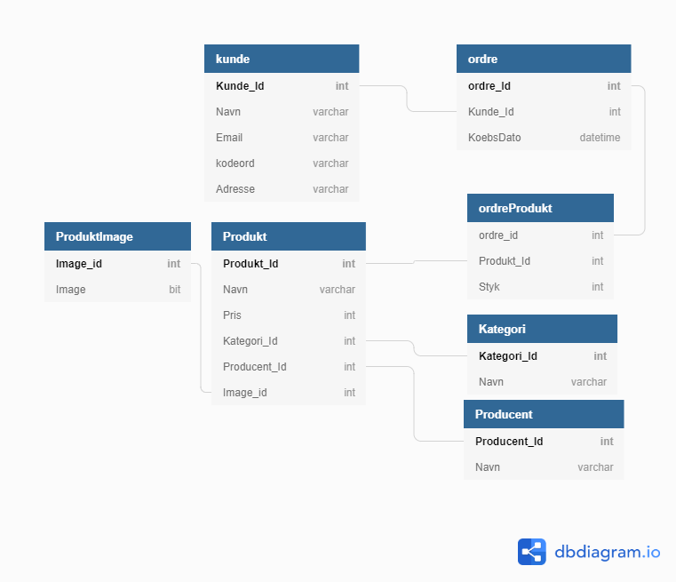

# Eshop Projektet

## Er diagram

# Krav til forsiden

  - [ ] Forsiden viser et antal produkter med et billede af hver, prisen, navn og en knap til at lægge varen i kurven
  - [ ] Der benyttes Paging således at forsiden kun viser et bestemt antal produkter ad gangen. Man kan se at der evt. er flere produkter
  - [ ] Der er mulighed for at søge på "Brand" og på "Type" eller lignende
  - [ ] Der er også fritekst-søgning
  - [ ] Der er mulighed for stigende og faldende sortering
  - [ ] Der vises et ikon med en varekurv og et antal varer i kurven. Klikkes på ikonet, vises varekurven
  - [ ] Lægges en vare i kurven, vises den opdaterede varekurv

# Krav til varekurven

  - [ ] Varekurven viser en opdateret liste af valgte produkter, med billede, navn, styk-pris, antal (skal kunne ændres) samt linjepriseen.
  - [ ] Der skal være en Update knap, som opdaterer priserne hvis man ændrer antallet.
  - [ ] Det skal være muligt at fjerne et produkt fra varekurven, hvis man fortryder valget
  - [ ] Der skal være en Checkout knap, som fører til Checkout-siden
  - [ ] Der skal være en knap, der giver mulighed for at fortsætte med at handle, inden man går til checkout

# Krav til checkout

  - [ ] Brugeren skal afgive oplysninger om email, navn, adresse, valg af betalingsmiddel og forsendelse
  - [ ] Når brugeren trykke på Køb knappen, skal der udsendes en mail som bekræftelse af købet
  
  
 # Administration

 - [ ]   En Admin side, der giver en administrator en liste over alle produkter 
 - [ ]   Admin siden skal have mulighed for at redigere produkterne og deres data.
 - [ ]   Der er fokus på at demonstrere update og delete af en graf af data.
